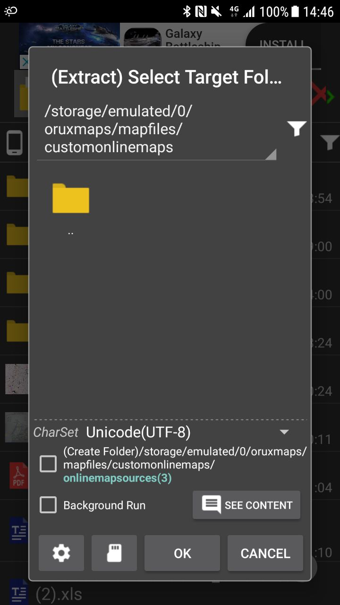
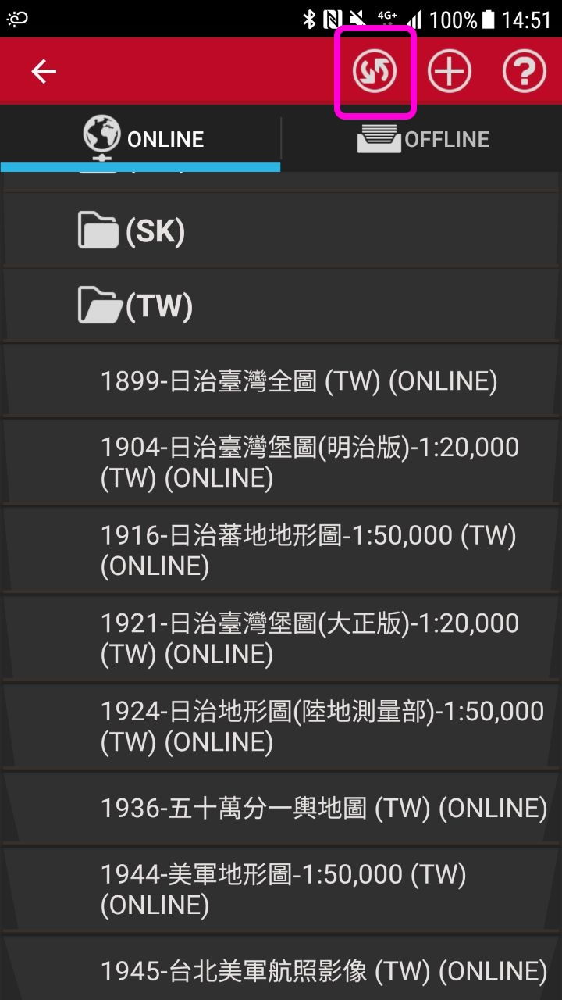

# tw_mapsources
Online map sources of Taiwan

# Installation Guide
1. Visit https://goo.gl/9YJ4LF to download onlinemapsources.zip
2. Extract onlinemapsources.zip to [path_to_oruxmaps]/mapfiles/customonlinemaps/
3. Reset cache or refresh list if necessary

Extraction destination (location of custom onlinemapsources.xml)

Refresh online map list

Reset online map cache (Global setting > Maps > Reset online cache)

# Map Sources
1899-日治臺灣全圖
1904-日治臺灣堡圖(明治版)-1:20,000
1916-日治蕃地地形圖-1:50,000
1921-日治臺灣堡圖(大正版)-1:20,000
1924-日治地形圖(陸地測量部)-1:50,000
1936-五十萬分一輿地圖
1944-美軍地形圖-1:50,000
1945-美軍繪製臺灣城市地圖
1945-台北美軍航照影像
1956-臺灣土地利用及林型圖
1956-臺灣地形圖-1:50,000
1966-臺灣省水利工程、水文站及基準點位置圖
1989-臺灣經建1版地形圖-1:25,000
2001-臺灣經建3版地形圖-1:25,000
通用版電子地圖
地圖產生器-魯地圖
地圖產生器-經建三

# Map URLs and Zoom Levels
https://goo.gl/tCZBDR