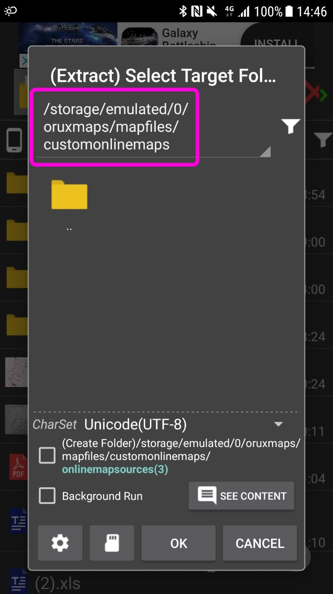

# tw_mapsources
Online map sources of Taiwan

# Installation Guide
1. Visit https://goo.gl/9YJ4LF to download onlinemapsources.zip (Or alternatively, https://shorturl.at/ftv27 for uncompressed file)
2. Extract onlinemapsources.zip to [path_to_oruxmaps]/mapfiles/customonlinemaps/
3. Reset cache or refresh list if necessary

Extraction destination (location of custom onlinemapsources.xml)

Refresh online map list

Reset online map cache (Global setting > Maps > Reset online cache)

# Map Sources
1899-日治臺灣全圖 
1904-日治臺灣堡圖(明治版)-1:20,000 
1916-日治蕃地地形圖-1:50,000 
1921-日治臺灣堡圖(大正版)-1:20,000 
1924-日治地形圖(陸地測量部)-1:50,000<mark>2018 中研院新版</mark> 
1936-五十萬分一輿地圖 
1932-二十萬分一帝國圖 
1936-五十萬分一輿地圖 
1939-日治臺灣全圖(第五版) 
1944-美軍地形圖-1:50,000 
1945-美軍繪製臺灣城市地圖 
1945-台北美軍航照影像 
1956-臺灣土地利用及林型圖 
1956-臺灣地形圖-1:50,000 
1966-臺灣省水利工程、水文站及基準點位置圖 
1989-臺灣經建1版地形圖-1:25,000 
2001-臺灣經建3版地形圖-1:25,000 
2013-正射影像圖 
2013-臺灣通用正射影像-航照圖混合 
通用版電子地圖 
地圖產生器-魯地圖 
地圖產生器-經建三 
地圖產生器-航跡圖層 

# Map URLs and Zoom Levels
https://goo.gl/tCZBDR
